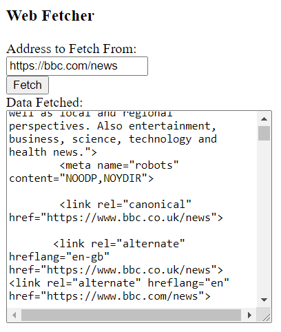

WebFetcher
==========

A utility to retrieve text over the web implemented in PHP and JavaScript.

Obviously a text-only web fetcher that runs only within a web browser isn't the most useful thing in the world.  This program is mostly meant to serve as a basis for further experimentation and more complex utilities.

Running
-------

Because of web security constraints, it will be necessary to install the program on a local web server that runs PHP.  Follow the steps below to do so:

1. Download and install XAMPP, which is a bundle of several different web server technologies, notably the Apache web server and the PHP server-side web programming language.

2. Run XAMPP and, on the control panel, click the Start button for Apache.  If an error is displayed, it is likely that some other web server is already using the default port, 80.  In that case, click the Config button, then click the "Apache (httpd.conf)" item from the context menu that appears, locate the line "Listen 80" within the .conf file, change it to, say, "Listen 8080", and save.  Also, if running in Linux, the control panel application may or may not work, and it may instead be necessary to run "sudo chmod +x xampp" and "sudo xampp start" from within the proper directory.

3. In a file explorer window, navigate to the htdocs directory of the XAMPP installation, perhaps at "C:\xampp\htdocs" or "/opt/lampp/htdocs/".

4. Copy WebFetcher.html, WebFetcher.js, and WebFetcher.php into the htdocs directory.

5. Start a web browser and navigate to the URL "http://localhost/WebFetcher.html" (or, if the web server was configured to run on port 8080 in step 2, use "http://localhost:8080/WebFetcher.html" instead).

6. Click the fetch button to get the web page at the pre-specified URL.
